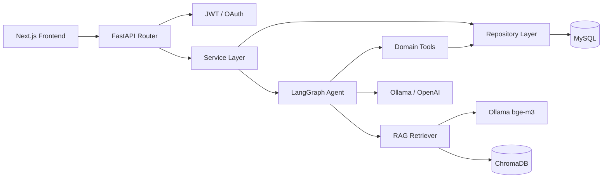
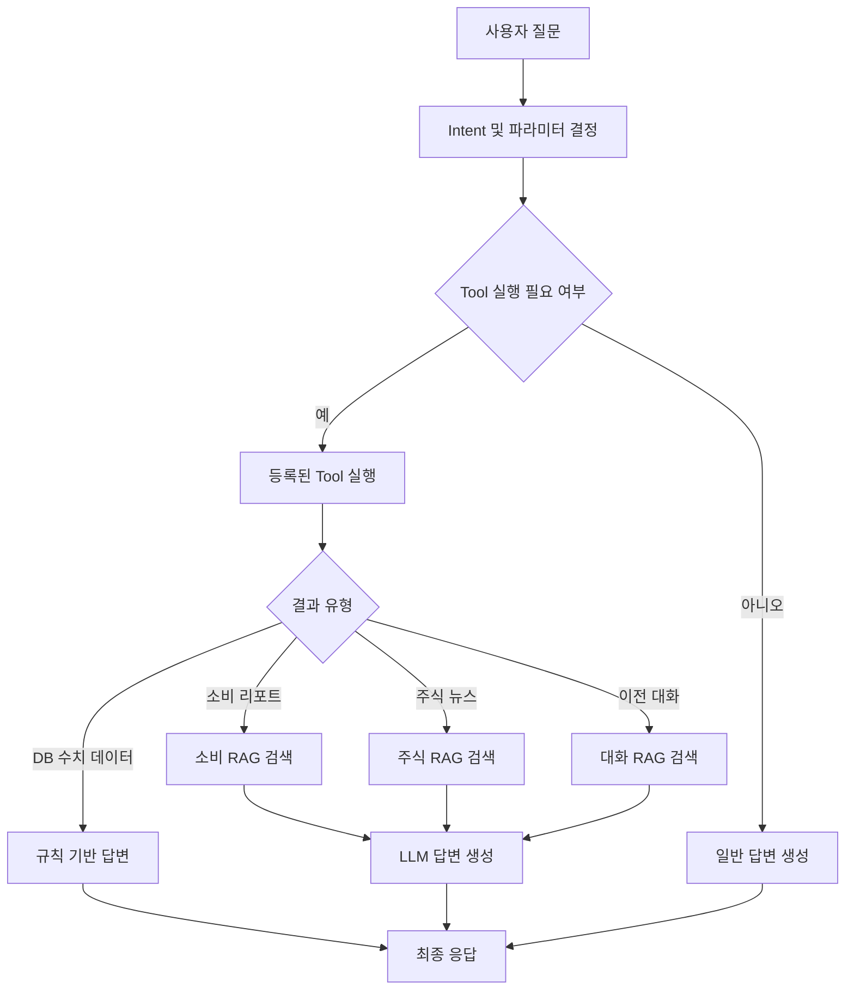

# MoneyPilot Backend

> 개인의 소비·자산·투자 데이터를 통합 분석하고, 금융 AI Agent를 통해 맞춤형 정보를 제공하는 금융자산관리 서비스의 백엔드입니다.

## 1. 프로젝트 소개

**MoneyPilot**은 사용자의 금융 데이터를 기반으로 다음 기능을 제공하는 개인 금융 관리 플랫폼입니다.

- 월별 소비 내역 및 소비 패턴 분석
- 카드 명세서·거래 내역 관리
- AI 기반 월간 소비 코칭 리포트
- 사용자 금융 프로필 및 투자 성향 관리
- 예금·적금·보험 등 금융상품 조회 및 추천
- 관심 종목, 주가, 뉴스, 리포트 및 알림
- Tool Calling과 RAG를 결합한 금융 AI Agent
- Google·Kakao OAuth 및 JWT 인증
- 관리자용 사용자·토큰 사용량 관리

백엔드는 **FastAPI**를 중심으로 Router–Service–Repository 계층을 분리했으며,  
관계형 데이터는 **MySQL**, 벡터 검색 데이터는 **ChromaDB**에 저장합니다.

---

## 2. 주요 기능

### 2.1 인증 및 사용자 관리

- 이메일 회원가입 및 로그인
- Access Token / Refresh Token 기반 JWT 인증
- Google OAuth 로그인
- Kakao OAuth 로그인
- 사용자 정보 조회·수정·탈퇴
- 사용자별 금융 프로필 및 투자 성향 관리

### 2.2 소비 분석

- 카드 명세서 및 거래 내역 등록
- 월별 총수입·총지출 계산
- 고정비·변동비 분석
- 카테고리별 소비 분석
- 카드별 사용금액 분석
- 전월 대비 소비 증감 분석
- 과소비 카테고리 추출
- 월말 예상 소비액 계산
- AI 월간 소비 코칭 리포트 생성 및 저장

### 2.3 금융상품

- 예금·적금·보험 상품 조회
- 사용자 금융 성향 기반 상품 추천
- 금융상품 문서 임베딩 및 벡터 검색
- 상품 추천 사유 생성

### 2.4 주식 및 뉴스

- 종목 정보 및 주가 조회
- 관심 종목 관리
- 종목별 뉴스 조회
- 뉴스 요약 및 감성 분석
- 섹터별 인사이트 제공
- 종목 리포트 생성
- 목표 가격 알림 관리
- 주식 뉴스 RAG 검색

### 2.5 금융 AI Agent

사용자 질문을 분석한 뒤 적절한 Tool 또는 RAG 검색을 실행합니다.

지원하는 주요 Intent는 다음과 같습니다.

| Intent | 설명 |
|---|---|
| `spending_summary` | 월별 소비 요약 조회 |
| `spending_category` | 카테고리별 소비 조회 |
| `spending_report` | 소비 분석 리포트 RAG 검색 |
| `finance_profile` | 금융 프로필 조회 |
| `risk_profile` | 투자 성향 조회 |
| `stock_price` | 종목 가격 조회 |
| `stock_news` | 주식 뉴스 RAG 검색 |
| `agent_chat_rag` | 이전 대화 기반 RAG 검색 |
| `general` | 일반 금융 질문 |

정확한 금액과 통계는 규칙 기반 응답으로 생성하고,  
설명형 질문과 RAG 검색 결과는 LLM을 이용해 자연어 답변으로 구성합니다.

---

## 3. 시스템 아키텍처



### Agent 처리 흐름



---

## 4. 기술 스택

### Backend

| 분류 | 기술 |
|---|---|
| Language | Python |
| Web Framework | FastAPI |
| Validation | Pydantic |
| ORM | SQLAlchemy |
| Migration | Alembic |
| Database | MySQL / PyMySQL |
| Authentication | JWT, Passlib, bcrypt |
| OAuth | Google OAuth, Kakao OAuth |
| HTTP Client | HTTPX |
| AI Agent | LangGraph |
| LLM Integration | Ollama, OpenAI |
| Embedding | Ollama `bge-m3` |
| Vector DB | ChromaDB |
| RAG Integration | LangChain Chroma, LangChain Ollama |
| Data Processing | Pandas, NumPy, OpenPyXL |
| Server | Uvicorn |

### 외부 API

- 공공데이터포털 금융·주식 데이터
- 네이버 뉴스 검색 API
- GNews API
- Google Custom Search API
- YouTube Data API
- Google OAuth
- Kakao OAuth

---

## 5. 디렉터리 구조

```text
moneypilot_back/
├── alembic/                     # DB 마이그레이션
├── app/
│   ├── agent/                   # LangGraph 기반 금융 Agent
│   │   ├── tools/               # Agent가 실행하는 도메인 Tool
│   │   ├── answer_builder.py    # 규칙 기반·LLM 답변 생성
│   │   ├── decision_router.py   # Intent 및 파라미터 결정
│   │   ├── graph.py             # Agent Graph 정의
│   │   ├── prompts.py           # Agent Prompt
│   │   ├── runner.py            # Agent 실행 진입점
│   │   ├── schemas.py           # Agent 입출력 Schema
│   │   ├── state.py             # LangGraph State
│   │   └── tool_registry.py     # Tool 등록 및 실행
│   ├── clients/                 # 외부 API·LLM Client
│   ├── core/
│   │   ├── config.py            # 환경변수 및 애플리케이션 설정
│   │   ├── database.py          # SQLAlchemy Engine·Session
│   │   ├── dependencies.py      # FastAPI Dependency
│   │   ├── disclaimer.py        # 금융 정보 면책 문구
│   │   └── security.py          # JWT 및 인증 보안
│   ├── models/                  # SQLAlchemy Model
│   ├── rag/
│   │   ├── builders/            # DB 데이터를 RAG 문서로 변환
│   │   ├── ingestors/           # 문서 임베딩 및 Chroma 저장
│   │   ├── retrievers/          # 도메인별 벡터 검색
│   │   ├── chunkers.py          # 문서 Chunk 분할
│   │   ├── embeddings.py        # 임베딩 생성
│   │   ├── metadata.py          # RAG Metadata 구성
│   │   ├── rag_constants.py     # Domain·Feature·Collection 상수
│   │   ├── rag_service.py       # 공통 RAG Service
│   │   └── vector_store.py      # ChromaDB 연결
│   ├── repositories/            # DB 접근 및 CRUD
│   ├── routers/                 # API Endpoint
│   ├── schemas/                 # API Request·Response Schema
│   ├── services/                # 비즈니스 로직
│   └── main.py                  # FastAPI Application
├── parsers/                     # 파일·데이터 Parser
├── .env.example                 # 환경변수 예시
├── alembic.ini                  # Alembic 설정
├── requirements.txt             # Python 패키지
└── test_ollama.py               # Ollama 연결 테스트
```

---

## 6. 주요 데이터 모델

| 영역 | 주요 모델 |
|---|---|
| 사용자 | User, OAuthAccount, FinanceProfile |
| 소비 | CardStatement, Transaction, MonthlySpendingSummary |
| 소비 분석 | CategorySpending, CardSpending, AnalysisReport |
| Agent | AgentChatSession, AgentChatMessage |
| 금융상품 | DepositProduct, SavingProduct, InsuranceProduct |
| 주식 | Stock, Watchlist, StockReport |
| 뉴스 | News |
| 알림 | Alert |
| 관리자 | TokenUsageLog, TokenLimitSetting |

---

## 7. API 구성

FastAPI 서버 실행 후 Swagger UI에서 전체 API 명세를 확인할 수 있습니다.

```text
http://localhost:8000/docs
```

ReDoc:

```text
http://localhost:8000/redoc
```

### 주요 API Prefix

| Prefix | 설명 |
|---|---|
| `/api/auth` | 회원가입·로그인·OAuth·토큰 |
| `/api/users` | 사용자 정보 |
| `/api/finance` | 금융 프로필 및 금융 정보 |
| `/api/spending` | 월별 소비 분석 및 AI 리포트 |
| `/api/transactions` | 거래 내역 |
| `/api/financial-products` | 금융상품 |
| `/api/agent` | 금융 AI Agent |
| `/api/chatbot` | 금융 챗봇 |
| `/api/rag` | 주식·금융 RAG |
| `/api/youtube` | 금융 콘텐츠 검색 |
| `/api/admin` | 관리자 기능 |

### 상태 확인

```http
GET /
```

응답:

```json
{
  "message": "MoneyPilot API server is running"
}
```

---

## 8. 로컬 실행 방법

### 8.1 저장소 Clone

```bash
git clone -b dev https://github.com/shinseohyeong/moneypilot_back.git
cd moneypilot_back
```

### 8.2 가상환경 생성

#### macOS / Linux

```bash
python3 -m venv venv
source venv/bin/activate
```

#### Windows

```bash
python -m venv venv
venv\Scripts\activate
```

### 8.3 패키지 설치

```bash
pip install --upgrade pip
pip install -r requirements.txt
```

### 8.4 환경변수 설정

```bash
cp .env.example .env
```

Windows PowerShell:

```powershell
Copy-Item .env.example .env
```

`.env`에 실제 환경에 맞는 값을 입력합니다.

### 8.5 데이터베이스 생성

MySQL에서 프로젝트용 데이터베이스를 생성합니다.

```sql
CREATE DATABASE moneypilot
CHARACTER SET utf8mb4
COLLATE utf8mb4_unicode_ci;
```

### 8.6 마이그레이션 적용

```bash
alembic upgrade head
```

현재 DB Schema 변경을 기반으로 새 Revision을 생성할 때:

```bash
alembic revision --autogenerate -m "migration message"
alembic upgrade head
```

`Target database is not up to date` 오류가 발생하면 먼저 기존 Migration을 적용합니다.

```bash
alembic upgrade head
```

### 8.7 Ollama 모델 준비

Ollama가 설치되고 서버가 실행 중이어야 합니다.

```bash
ollama serve
```

사용 모델 예시:

```bash
ollama pull gemma4:e4b-it-qat
ollama pull bge-m3:latest
```

설치된 모델 확인:

```bash
ollama list
```

### 8.8 FastAPI 서버 실행

```bash
uvicorn app.main:app --reload --host 0.0.0.0 --port 8000
```

접속:

```text
API:         http://localhost:8000
Swagger UI:  http://localhost:8000/docs
ReDoc:       http://localhost:8000/redoc
```

---

## 9. 환경변수

현재 애플리케이션 설정에서 사용하는 주요 환경변수입니다.

```env
# Database
DB_HOST=localhost
DB_PORT=3306
DB_USER=root
DB_PASSWORD=
DB_NAME=moneypilot

# JWT
SECRET_KEY=change-this-secret-key
ALGORITHM=HS256
ACCESS_TOKEN_EXPIRE_MINUTES=30
REFRESH_TOKEN_EXPIRE_DAYS=7

# LLM Provider
LLM_PROVIDER=ollama
OPENAI_API_KEY=
OPENAI_MODEL=gpt-4o-mini

# Ollama
OLLAMA_BASE_URL=http://localhost:11434
OLLAMA_LLM_MODEL=gemma4:e4b-it-qat
OLLAMA_EMBEDDING_MODEL=bge-m3:latest

# Google OAuth
GOOGLE_CLIENT_ID=
GOOGLE_CLIENT_SECRET=
GOOGLE_REDIRECT_URI=http://localhost:8000/api/auth/google/callback

# Kakao OAuth
KAKAO_CLIENT_ID=
KAKAO_CLIENT_SECRET=
KAKAO_REDIRECT_URI=http://localhost:8000/api/auth/kakao/callback

# Public / Finance API
FINANCE_API_KEY=
PUBLIC_DATA_API_KEY=
PUBLIC_DATA_STOCK_SERVICE_KEY=

# Naver News
NAVER_CLIENT_ID=
NAVER_CLIENT_SECRET=
NAVER_NEWS_BASE_URL=https://openapi.naver.com/v1/search/news.json

# News / Search
GNEWS_API_KEY=
GOOGLE_API_KEY=
GOOGLE_SEARCH_ENGINE_ID=

# YouTube
YOUTUBE_API_KEY=
```

> `.env` 파일에는 API Key, OAuth Secret, JWT Secret, DB 비밀번호가 포함되므로 Git에 커밋하지 않습니다.

---

## 10. RAG 구성

### 공통 Metadata 예시

```python
metadata = {
    "domain": "spending",
    "feature": "analysis_report",
    "source_table": "analysis_reports",
    "source_id": 1,
    "user_id": 1,
    "month": "2026-05",
    "document_type": "category",
}
```

### Domain

- `spending`
- `stock`
- `financial_product`
- `user_profile`

### Feature

- `analysis_report`
- `stock_news`
- `financial_product`
- `finance_profile`

### RAG 저장 흐름

```text
원본 DB 데이터
→ RAG Document Builder
→ Chunk 분할
→ Ollama Embedding
→ Metadata 결합
→ ChromaDB Upsert
```

### RAG 검색 흐름

```text
사용자 질문
→ 질문 Embedding
→ 사용자·도메인·월 Metadata Filter
→ ChromaDB Similarity Search
→ 검색 Context 구성
→ LLM 답변 생성
```

### 소비 리포트 색인 시 주의사항

현재 소비 리포트 생성 로직은 다음 데이터를 DB에 저장합니다.

- `report_title`
- `summary_text`
- `category_text`
- `overspending_text`
- `card_text`
- `compare_text`
- `recommendation_text`
- `agent_response`

리포트 생성 이후 다음과 같이 RAG 저장 함수가 연결되어야 합니다.

```python
report = report_repository.save_or_update_report(...)

spending_report_ingestor.upsert(
    report=report,
    user_id=user_id,
    month=month,
)

return report
```

기존 DB 데이터는 자동으로 ChromaDB에 저장되지 않으므로, 별도의 재색인 스크립트 또는 관리자 API가 필요합니다.

---

## 11. CORS

로컬 프론트엔드 개발 서버 연결을 위해 다음 Origin이 등록되어 있습니다.

```text
http://localhost:3000
http://127.0.0.1:3000
```

배포 환경에서는 허용 Origin을 환경변수로 분리하고 실제 프론트엔드 도메인만 등록하는 것을 권장합니다.

---

## 12. 테스트 및 점검

### 서버 상태 확인

```bash
curl http://localhost:8000/
```

### Ollama 연결 확인

```bash
python test_ollama.py
```

### RAG 기본 점검

```bash
python -m app.test_embedding
python -m app.test_vector
python -m app.test_rag
```

프로젝트 내 테스트 파일의 실제 실행 방식은 각 파일의 진입점에 따라 달라질 수 있습니다.

### ChromaDB 문서 수 확인 예시

```python
from app.rag.vector_store import get_rag_collection

collection = get_rag_collection()
print("document count:", collection.count())
```

---

## 13. 트러블슈팅

### MySQL 연결 실패

확인 항목:

- MySQL 서버 실행 여부
- `DB_HOST`, `DB_PORT`
- `DB_USER`, `DB_PASSWORD`
- `DB_NAME` 존재 여부
- PyMySQL 설치 여부

### Alembic Target database is not up to date

```bash
alembic upgrade head
```

적용 후 새 Migration을 생성합니다.

```bash
alembic revision --autogenerate -m "migration message"
```

### Ollama Connection Refused

```bash
ollama serve
```

`.env` 확인:

```env
OLLAMA_BASE_URL=http://localhost:11434
```

다른 팀원의 Ollama 서버를 사용하는 경우 해당 서버가 외부 접속을 허용하는지, 방화벽과 Host 주소가 올바른지 확인합니다.

### RAG 문서를 찾지 못하는 경우

1. ChromaDB에 문서가 저장됐는지 확인
2. 저장과 검색이 같은 Collection을 사용하는지 확인
3. `CHROMA_DB_PATH`가 동일한지 확인
4. `user_id`의 문자열·정수 타입이 일치하는지 확인
5. `domain`, `feature`, `month` Metadata가 일치하는지 확인
6. Metadata Filter 없이 유사도 검색을 테스트
7. DB 저장 이후 RAG Ingestor가 실제 호출되는지 로그 확인

### Agent Tool Calling은 되지만 RAG만 실패하는 경우

Agent의 Intent 분류와 Tool 실행은 정상이며, 다음 영역을 우선 확인합니다.

```text
DB 원본 데이터 존재
→ RAG Builder 실행
→ Embedding 생성
→ ChromaDB Upsert
→ 동일 Collection에서 검색
```

---

## 14. 개발 규칙

### 계층별 역할

- **Router**: 요청·응답 처리 및 Dependency 주입
- **Service**: 비즈니스 로직
- **Repository**: 데이터베이스 CRUD
- **Model**: SQLAlchemy Table 정의
- **Schema**: Pydantic 검증 및 직렬화
- **Agent Tool**: Agent가 호출하는 도메인 기능
- **RAG Builder**: 원본 데이터를 검색용 문서로 변환
- **RAG Ingestor**: 임베딩 및 Vector DB 저장
- **RAG Retriever**: Metadata Filter와 유사도 검색

### Branch

```text
main    배포 및 안정 버전
dev     통합 개발 브랜치
feature 기능 단위 개발 브랜치
```

Feature Branch 예시:

```bash
git switch dev
git pull --rebase origin dev
git switch -c feature/spending-rag-indexing
```

---

## 15. 금융 정보 면책

MoneyPilot이 제공하는 분석, 추천, 뉴스 요약 및 AI 답변은 정보 제공을 목적으로 합니다.  
실제 금융상품 가입이나 투자 판단은 사용자의 책임이며, 서비스의 답변은 전문적인 투자 자문을 대체하지 않습니다.

---

## 16. 향후 개선 사항

- 기존 DB 데이터 일괄 재색인 기능
- Collection 이름과 Chroma 경로의 공통 상수화
- RAG 검색 정확도 평가 데이터셋 구축
- Metadata Filter 및 유사도 Threshold 튜닝
- Agent Intent 분류 테스트 자동화
- 비동기 외부 API 호출 확대
- 단위·통합 테스트 추가
- Docker 및 CI/CD 구성
- 운영 환경 CORS·Secret 관리 강화

---

## License

본 프로젝트는 교육 및 포트폴리오 목적으로 개발되었습니다.
